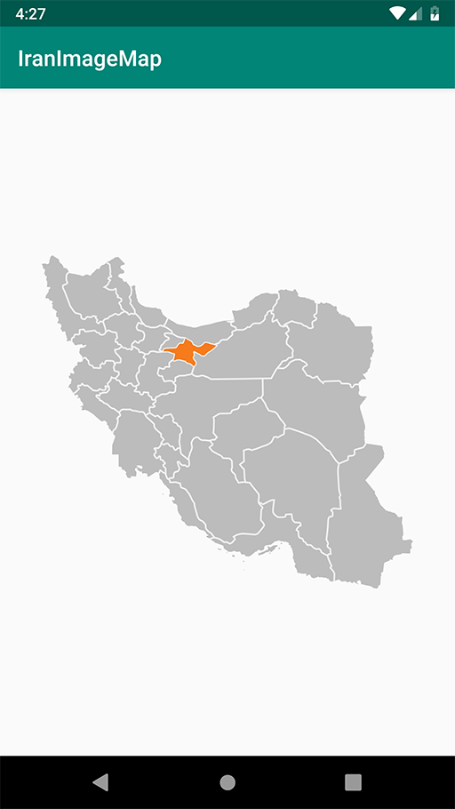

[](https://jitpack.io/#mehdi-salehi/IranImageMap)

Iran Image Map
============
Iran Image Map is ImageView with customizable provinces on map



## Usage

```xml
    <com.salehi.iranimagemap.lib.IranImageMap
            android:id="@+id/map"
            android:layout_width="match_parent"
            android:layout_height="wrap_content"/>
```

## Code

```java
        IranImageMap imageMap = findViewById(R.id.map);
        imageMap.clearAllProvince();
        imageMap.setActiveProvince(ProvinceList.Tehran);
```

## Download

 include in app level build.gradle
 ```groovy
        repositories {
           maven { url 'https://jitpack.io' }
        }
 ```
```groovy
        implementation 'com.github.mehdi-salehi:IranImageMap:1.0'
```

## License
Licensed under the Apache License, Version 2.0.